

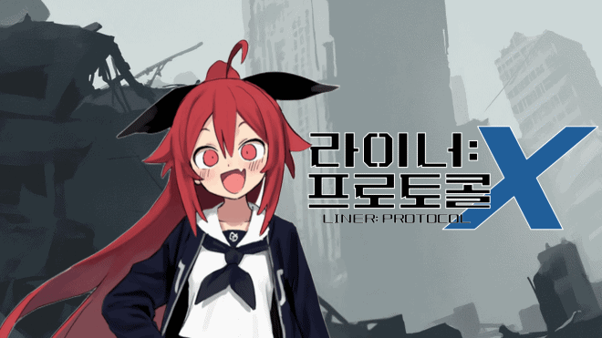

Liner: Protocol X은 모바일(Android) 플랫폼을 위한 타워 디펜스 RPG입니다. 
고도로 발전한 외계 문명이 자취를 감춘 미지의 폐허 행성에서, 플레이어는 외계 생명체와 자동화 기계 장치의 공격을 막아내며 생존해야 합니다.
이 과정에서 로그라이크 요소와 RPG 성장 시스템이 결합된 스테이지 기반의 타워 디펜스를 통해, 
플레이어는 매번 다른 전략적 선택을 경험하게 됩니다.

  
----
  
## 📌프로젝트 개요
  
- **프로젝트**: Liner: Protocol X 
- **개발환경**: Unity, C#, GitHub,  
- **플렛폼**  : Android, Wep
- **타임라인**:  
  🔹25.4월 초순 와이어프레임 및 프레임 워크 작성, 역할 분담. 
  🔹25.4월 중순 전반 적인 주요 기능 개발 완료, 컨탠츠 기획. 
  🔹25.5월 초순 중간발표, MVP 개발. 
  🔹25.5월 중순 데모버전 개발 완료, 유저 테스트 준비.   
  🔹25.5월 중순 유저 피드백 수렴 및 수정.   
- **주요기능** :  
  튜토리얼, 랜덤 맵 생성, 랜덤 몬스터 생성, 배틀카드 선택, 오퍼레이터 스킬 사용, 타워 설치, 오퍼레이터 강화 및 성장, 오퍼레이터 제작, 타워 & 오퍼레이터 편성 시스템, 세이브 로드 시스템, Excel과 JSON을 통한 데이터 관리
  
----

## 🎥게임 시연 영상

https://www.youtube.com/watch?v=Pp3MBHyn6WI

----

## 🎮플레이 방법

1. 조작키
   - Android : 터치.
   - Web : 마우스 좌클릭.
     
2. 타워 설치 및 스킬 사용
   - Android : 터치 후 드래그.
   - Web : 마우스 좌클릭 후 드래그.
----

## 🧑‍🤝‍🧑팀원 소개 및 역할 분담

| 이름 | 역할 | 
| ------ | ------|
| 손치완 | - 기획 리드 |
| 정형권 | - 개발 리드 |
| 김효중 | - 개발     |
| 최재혁 | - 개발     |
----

## 💡프레임워크

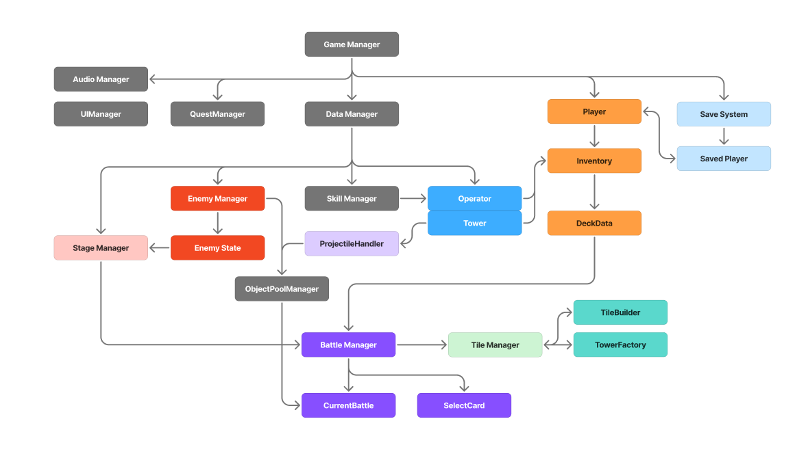

----

## ♾️게임 사이클
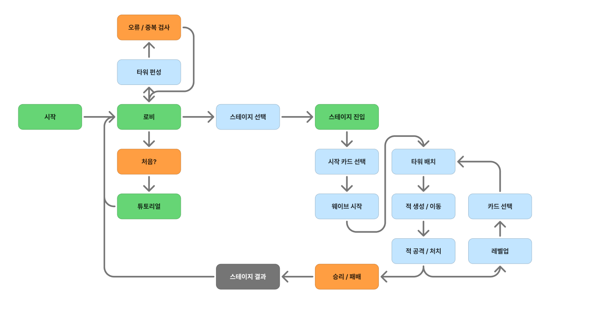

### ScenePreview

### 타이틀 씬  

- 화면을 터치하면 메인씬으로 넘어갑니다.

### 메인씬 

  <table width="100%">
    <tr>
      <th width="33%" align="center">로비</th>
      <th width="33%" align="center">스테이지</th>
      <th width="33%" align="center">편성</th>
    </tr>
    <tr>
      <td align="center">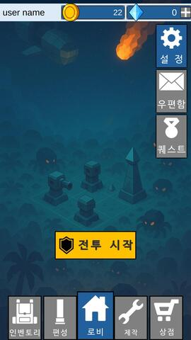</td>
      <td align="center">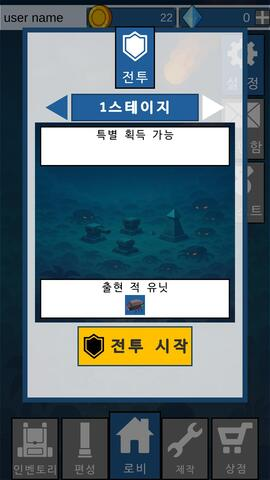</td>
      <td align="center">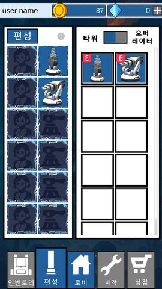</td>
    </tr>
    <tr>
      <td align="left"> - 하단 버튼을 이용하여 다른 패널로 이동합니다.  - 1스테이지 종료 후 우편함과 퀘스트가 활성화 됩니다.</td>
      <td align="left"> - 상단 방향 버튼을 눌러 스테이지를 선택할 수 있습니다.  - 전투 시작 버튼을 눌러 배틀 씬에 입장 합니다.</td>
      <td align="left"> - 우측 상단 토글 버튼을 눌러 타워와 오퍼레이터를 표시합니다.  - 2스테이지 클리어시 활성화 됩니다.</td>
    </tr>
    <tr>
      <th style="text-align: center;">제작</th>
      <th style="text-align: center;">인벤토리</th>
      <th style="text-align: center;">상점</th>
    </tr>
    <tr>
      <td align="center"></td>
      <td align="center">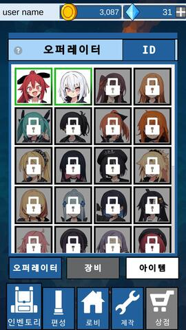</td>
      <td align="center">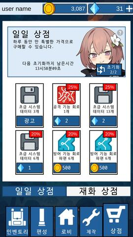</td>
    </tr>
    <tr>
      <td align="left"> - 제작 버튼을 눌러 아이템 및 오퍼레이터를 제작이 가능합니다.  - 방향키를 눌러 일반 제작, 희귀 제작, 특별 제작을 할 수 있습니다.  - 3스테이지 클리어시 활성화 됩니다</td>
      <td align="left"> - 오퍼레이터 아이콘을 눌러 오퍼레이터의 정보를 확인 가능합니다.  - 5스테이지 클리어시 활성화 됩니다</td>
      <td align="left"> - 매일 초기화 되는 일일 상점 입니다..  - 7스테이지 클리어시 활성화 됩니다</td>
    </tr>
  </table>

  

### 튜토리얼 씬  

  <table width="100%">
    <tr>
      <th width="33%" align="center">튜토리얼 시작</th>
      <th width="33%" align="center">적/포탑 상성</th>
      <th width="33%" align="center">스킬 사용</th>
    </tr>
    <tr>
      <td align="center"></td>
      <td align="center"></td>
      <td align="center"></td>
    </tr>
    <tr>
      <td align="left"> - 스테이지의 전반적인 흐름을 알게되고 타워 설치 및 배치 방법을 배웁니다.</td>
      <td align="left"> - 타워의 속성과 적 속성에 대해 상하 관계를 배웁니다. </td>
      <td align="left"> - 오퍼레이터 스킬에 대해 배우고 사용방법을 배웁니다.</td>
    </tr>
  </table>

  

### 배틀 씬  

  <table width="100%">
    <tr>
      <th width="33%" align="center">스테이지 시작</th>
      <th width="33%" align="center">스테이지 진행</th>
      <th width="33%" align="center">스테이지 결과</th>
    </tr>
    <tr>
      <td align="center">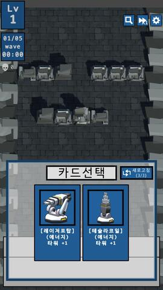</td>
      <td align="center">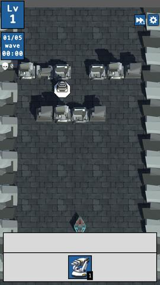</td>
      <td align="center">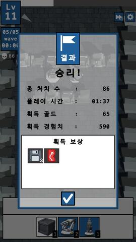</td>
    </tr>
    <tr>
      <td align="left"> - 웨이브의 수는 스테이지의 단계에 비레합니다.  - 15초동안 적 소환이 진행되고 5초 동안 정비하는 시간이 주어집니다. </td>
      <td align="left"> - 소환된 적을 처치하면 경험치 및 일정 확률로 골드와 아이템을 획득합니다.</td>
      <td align="left"> - 스테이지에 소환된 적을 모두 처치하면 승리합니다.  - 스테이지를 포기하거나 적이 기지에 도착하면 패배합니다.  - 게임이 끝나면 다시 Lobby Scene으로 들어옵니다.</td>
    </tr>
  </table>

    

----

## ⚙️주요 기능

## 플레이어 시스템 : SO + 공통 슬롯 기반의 일관된 구조 설계
이 플레이어 시스템은 엑셀 기반 기획 데이터를 JSON으로 변환한 뒤, 
게임 내에서 해당 데이터를 **ScriptableObject(SO)** 로 로딩하고 DIctionary에 캐싱하여 빠르고 일관된 방식의 데이터 접근을 가능하게 합니다.
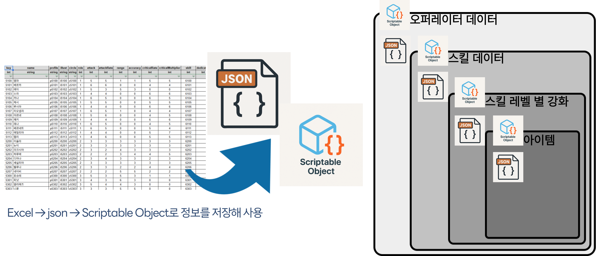  

- 기획 단계 Excel -> JSON으로 변환
- JSON을 SO에 피싱 후, Dictionary로 캐싱
- 오퍼레이터, 스킬, 강화, 아이템 등 대부분의 핵심 데이터에 적용
- 모든 게임 시스템에서 공통된 방식으로 데이터 접근 가능

#### UI슬롯 시스템 구조 
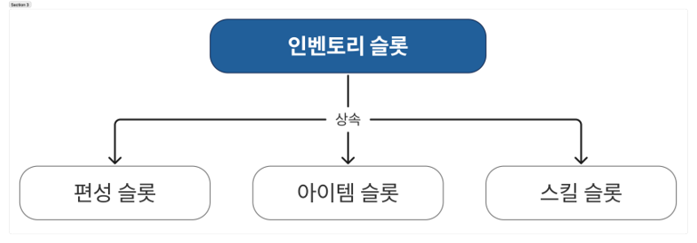 
UI 슬롯은 기본 슬롯 클래스()를 설계하고, 
아이템 슬롯, 스킬 슬롯, 편성 슬롯 등 각 시스템별 슬롯은 이를 상속받아 사용합니다. 

#### 팝업 시스템 구조 
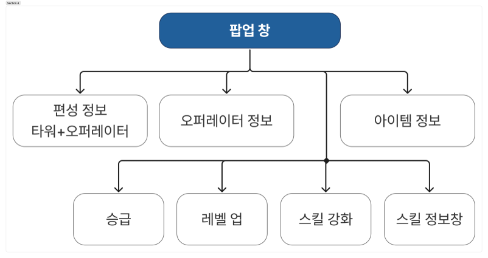 
모든 팝업은 공통된 흐름인 
열기 -> UI 세팅 -> 닫기 단계를 따르도록 구성되어 있습니다.

### 설계 이점
- SO + Dictionary 캐싱을 통한 빠르고 안정적인 데이터 접근 
- UI 슬롯 및 팝업의 공통 베이스 클래스 구조로 유지보수성 및 확장성 극대화 
- 기획 변경(엑셀 → JSON)과 개발 적용 간의 연결 흐름이 간결 
- 데이터-UI 연동이 명확하게 분리되어 <b>디자인 및 기능 구현 간 충돌 최소화</b> 

---

## 제작 시스템 : 데이터 기반 가중치 추첨 시스템 (3단계 구조)

이 제작 시스템은 <b>가챠 전용 3단계 확률 시스템</b>을 바탕으로 다양한 결과를 동적으로 생성합니다. 
운영자는 JSON 혹은 테이블 기반의 외부 데이터로 <b>확률 조정 및 구조 확장</b>이 가능합니다.

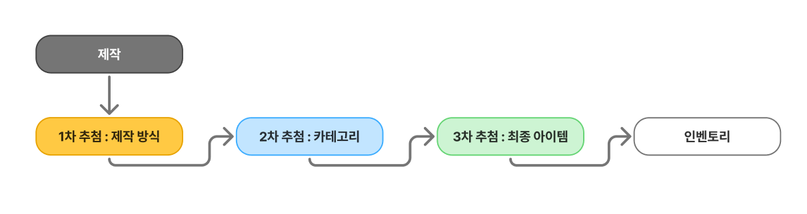 

- 1차 추첨 : 제작 방식 (Production Key) 선택
- 2차 추첨 : 카테고리 (Category) 선택
- 3차 추첨 : 최종 아이템 (Entry) 선택

전반 적으로 모든 단계에서 가중치 기반 추첨 방식을 적용 
동일 확률 내에서도 결과가 편중되지 않도록 OrderBy(Random.value) 사용 

### 설계 이점
- 가중치 기반 구조로 유연한 밸런스 조정 기능
- 새로운 제작 방싱/카테고리/아이템 추가 시 코드 수정 없이 테이블 데이터만 갱신으로 추가 가능
- **랜덤 순서 정렬(OrderBy)** 를 활용한 추첨 편향 방지
- 단계별 로그 출력 및 디버깅 용이성 확보

---

## 카드 시스템 : 덱 카드-강화 카드 매핑을 위한 이중 Dictionary 기반 구조

이 카드 시스템은 <b>덱 카드(TowerOperList)와 강화 카드(CardTable)의 일대다 관계</b>를 정의하고,
전투 시작 시 <b>무작위 강화 카드 슬롯을 구성</b>하기 위해 <b>이중 Dictionary 구조</b>를 활용합니다. 
원본 데이터와 복제 데이터를 분리함으로써 <b>데이터 무결성을 유지</b>하면서도 동적인 카드 선택 로직을 구성할 수 있습니다.

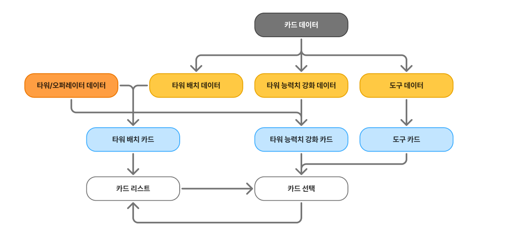 

- 덱 카드마다 초기 강화 카드(Key: TowerOperList, Value: List<CardTable>)를 매핑
- 강화 선택 전용 복제 딕셔너리를 별도로 구성하여 슬롯 재배치 처리
- 전투 시작 시 슬롯마다 덱 카드 및 강화 카드 조합을 무작위로 선택하여 UI에 할당

모든 과정에서 강화 키 리스트 복제, 중복 방지 제거 로직, 무작위 강화 카드 추첨을 포함합니다. 
선택된 카드에 한해 강화 키가 확장되며, 유저 행동 기반으로 동적으로 변화하는 구조를 가집니다. 

### 설계 이점
- 이중 Dictionary 구조를 통해 원본/복제 데이터를 분리하여 안정성 확보
- 강화 키 할당 및 제거가 독립적으로 관리되며, UI 동기화에 최적화된 구조
- 강화 대상 카드의 중복 방지 처리로 전투 시작 시 카드 다양성 확보
- 강화 키는 외부 테이블(Json 등) 기반으로 불러오므로 유연한 데이터 갱신 및 확장 가능
- 유저 선택에 따라 강화 키가 점진적으로 확장되어 전략적 성장 유도

---

## 타일 시스템 : 타워 배치와 경로 검증을 위한 2D 그리드 + A* 기반 설계

이 타일 시스템은 <b>맵 생성, 타워 설치, 타워 삭제</b>를 통합적으로 관리할 수 있도록 설계된 시스템입니다. 
<b>스테이지 시작 시 JSON 기반의 맵 데이터</b>를 불러와 타일 단위로 맵을 구성하며,
맵상의 모든 오브젝트(벽, 장애물 등)는 2차원 정수 배열을 기반으로 관리됩니다.

- 맵 데이터는 JSON → 2차원 정수 배열로 변환
- 각 타일은 설치 가능 여부 / 통과 가능 여부의 상태 값을 가짐
- 타워 배치 시, 터치 좌표 → 타일 좌표로 변환하여 타워 영역 계산
- 타워 설치 가능 여부는 해당 영역의 타일 상태로 결정

단순히 타일이 비어있다고 설치하는 것이 아니라, 타워 설치로 인해 적의 경로가 차단되는지 여부를 실시간으로 판단 하여 설치를 허용 또는 거부합니다.
이 경로 차단 여부를 판단하기 위해 <b>A*알고리즘</b>을 별도로 사용하였습니다.

### 왜 A*알고리즘이 필요한가?

A* 알고리즘을 사용하는 이유는 NavMesh와는 별도로 작동하는 경로 탐색이 필요하기 때문입니다. 
경로가 존재하는지 확인하는 기능 자체는 NavMeh에 존재하지만 장애물(Obstacle)이 실제 NavMesh상에 존재해야 합니다. 
하지만 이 게임에서는 적의 이동에서 NavMesh를 사용하기에 이와 충돌 되는 상황이 일어날 수 있습니다. 
만약 NavMesh의 기능만으로 길을 판단한다면 아직 설치가 확정되지 않은 타워를 장애물로 취급해야하고 
이는 적 이동에서 문제가 발생시킵니다. 
이러한 문제를 해결하기 위해 NavMesh와는 별도로 A* 알고리즘을 사용하여 경로 유효성을 판단하였습니다 

### 설계 이점
- 설치 전 타워가 경로를 막는지 실시간으로 판단 가능
- NavMesh와 분리된 경로 검증을 통해 유연한 타워 배치 지원
- JSON 기반 맵 데이터 → 타일 기반 2차원 배열로 구성되어 <b>맵 확장 및 편집에 용이</b>
- A* 알고리즘 적용으로 빠르고 정확한 경로 유효성 판단 가능
- 플레이어 입력 → 타일 좌표 변환 → 설치 가능 여부 판단 → 경로 검증까지 일관된 흐름 유지
  
---

## 스킬 시스템 : 인터페이스 기반 스킬 등록 및 실행 구조
이 스킬 시스템은 ISKill 인터페이스를 기반으로 개별 스킬을 게임 시작 시 자동으로 등록하고,  
스킬 사용 시 JSON 데이터를 활용하여 동작을 수행하는 구조 입니다. 

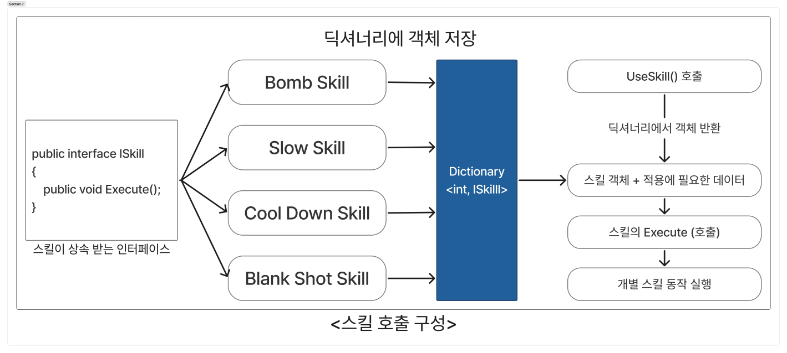 

- 게임 시작시, ISkill을 상속한 모든 스킬 클래스 인스턴스를 <b>딕셔너리에 등록</b>
- 스킬 사용시, 스킬 키를 기준으로 해당 스킬 객체를 딕셔너리에 조회
- 조화된 객체에 JSON 기반 스킬 데이터를 전달하여 실행 함수 호출

이 구조는 인터페이스 기반으로 각 스킬을 개별 클래스에서 구현함으로써, 스킬 추가 및 변경 시 기존 시스템을 수정하지 않고도 확장이 가능하도록 설계 되었습니다.

### 설계 이점
- ISkill 인터페이스 기반 구조로 <b>유지보수성과 확장성 향상</b>
- 스킬 로직의 <b>모듈화 및 테스트 용이성 확보</b>
- <b>데이터 기반 실행(JSON)</b>을 통한 유연한 스킬 세팅 및 튜닝 가능
- 새로운 스킬 추가 시 기존 시스템에 영향을 주지 않음

---

## 세이브 로드 시스템 : 저장 전용 클래스 기반의 JSON 직렬화 구조

이 세이브 로드 시스템은 <b>JSON 기반의 경량 저장 구조</b>를 통해 게임 데이터를 파일로 저장하고,
게임 시작 시 해당 데이터를 불러와 <b>플레이어 상태를 복원</b>하는 방식으로 동작합니다. 

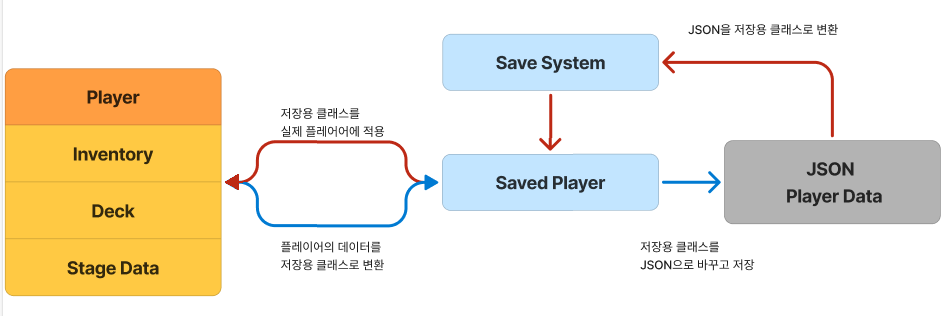 

- 게임 시작 시, 저장 파일(JSON)의 존재 여부를 확인
- 파일이 존재하면 해당 내용을 <b>플레이어 객체에 로드</b>
- 파일이 없을 경우 <b>기본 설정값을 기반으로 초기화</b>

저장 시에는 <b>불필요한 정보가 제외된 저장 전용 클래스</b>로 데이터를 변환하여 저장하고,
로드 시에는 해당 데이터를 다시 <b>플레이어 객체에 매핑</b>하여 반영합니다.

### 설계 이점
- 저장 구조와 게임 로직을 분리하여 <b>직렬화 효율성과 유지보수성 확보</b> 
- JSON 포맷 사용으로 <b>외부 수정 및 디버깅이 용이</b> 
- 저장 전용 클래스를 통해 <b>불필요한 런타임 정보 제외 및 파일 크기 최적화</b> 
- <b>기본값 적용 → 로드 → 덮어쓰기</b> 구조로 안정적인 초기화 지원
----

## 🛠️트러블 슈팅

### 1️⃣ NavMeshAgent 장애물 감속 문제

문제 상황 
- NavMeshAgent가 적용된 적 오브젝트가 장애물 옆을 지날 때 이동 속도가 갑자기 느려지거나 멈칫하는 현상 발생.

문제 해결
- NavMeshAgent속성, NavMeshObstacle 크기, 적 오브젝트 collider 크기 조정 및 Layer Collision Matrix 설정.

### 2️⃣ 편성한 Scriptable Object 데이터 처리 문제

문제 상황
- 편성 창에서 오퍼레이터/타워를 편성한 이후 사용한 SO의 값이 변경되었을 때, 테스트 이후에도 변경된 값이 So에 저장되는 문제가 발생.

문제 해결
- 오퍼레이터/타워를 복사한 휘발성 데이터를 덱에 저장.
- 인게임에서 사용하는 휘발성 데이터는 복사된 데이터이므로 SO데이터와 분리됨.

### 3️⃣ 메인씬 Dotween 작동 오류

문제 상황
- 메인 씬에서 Dotween을 사용한 "패널 이동 애니메이션", "클릭한 버튼 커지는 애니메이션"이 작동을 하지 않는 오류 발생

문제 해결
- bool값을 이용하여 게임 종료 조건이 달성하면 한번만 호출 될 수 있도록 설정.
- 게임이 종료되면 배틀 씬에서 사용되는 모든 코루틴과 Dotween을 실행을 종료되도록 설정.

### 4️⃣ 셰이더 작동 오류

문제 상황
- 커스텀 셰이더를 이용하여 슬롯을 꾸몄으나 스크롤뷰에서 벗어날 경우 가리는 마스킹 효과가 사라지는 현상 발생
- 모바일 빌드시 셰이더가 나오지 않는 현상

문제 해결
- 커스텀 셰이더에 stencil 효과를 적용하여 마스킹 효과를 적용
- 렌더링 설정 ZTest를 수정하여 셰이더 깨지는 현상 해결

